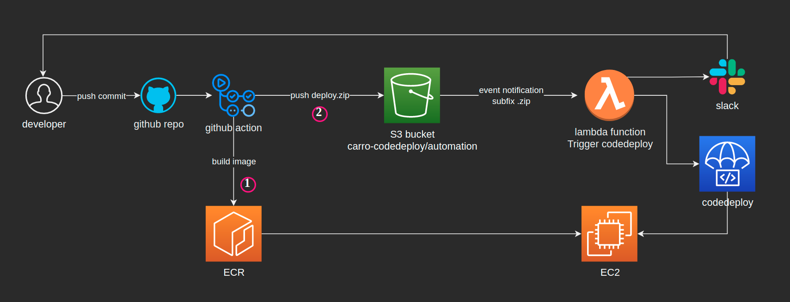

  

<h1 align="center">
  
<b>CICD With Codedeploy For Key-store-value</b>

</h1>

## Abstract
- Build a CI/CD Pipeline for current infra
- The solution here is to use Codedeploy to run remote install script of application
- AWS Resources: S3 bucket, lambda function, codedeploy and EC2 instance

## Table Of Contents
 * [S3 bucket](#S3-bucket)
 * [Lambda function](#Lambda-function)
 * [codedeploy](#codedeploy)
 * [EC2 instance](#EC2-instance)
 * [The whole processes](#The-whole-processes)
 * [Conclusion](#Conclusion)

---

##  **S3 bucket** 
- The bucket `carro-codedeploy` with object `automation` is registed event notification for `PUT` objects with subfix `.zip`. The event triggers the lambda function `carro-codedeploy`

##  **Lambda function** 
- The lambda function `carro-codedeploy` with lambda handler written in python has two functions:
  - Invoke codedeploy by creating application deployment with input of the S3 object `deploy.zip`, wait for the deployment complete and get its status
  - Send slack message to developer for process notification of deployment and its status

##  **codedeploy** 
- The structure:
  - application: `key-store-value`
    - deployment group: name `ec2_dev` with target instance which contains tag `Key=Name,Value=ec2-dev`

##  **EC2 instance** 
- The instance must be installed codedeploy-agent
- The instance needs to be setup for using `docker-compose` and application env file `.env`

##  **The whole processes** 
1. Developer merges commit to `master` branch
2. Github action builds docker image and push to ECR
3. Github action packs and pushes `deploy.zip` (with image version file `image_version.txt`) to S3 bucket
4. S3 event notification triggers lambda function
5. Lambda function invokes codeployment
6. Codedeploy agent runs script install to deploy new version
7. And then lambda function sends status of deployment to developer through slack

##  **Conclusion** 
- With codedeploy we can implement CICD pipeline in serverless and security
- We create multiple applications and deployments to handle different applications on many environtments.

---

<h3 align="center">
  <a href="https://dev.to/vumdao">:stars: Blog</a>
   · 
  <a href="https://github.com/vumdao">Github</a>
   · 
  <a href="https://stackoverflow.com/users/11430272/vumdao">stackoverflow</a>
   · 
  <a href="https://www.linkedin.com/in/vu-dao-9280ab43/">Linkedin</a>
   · 
  <a href="https://www.linkedin.com/groups/12488649/">Group</a>
   · 
  <a href="https://www.facebook.com/CloudOpz-104917804863956">Page</a>
   · 
  <a href="https://twitter.com/VuDao81124667">Twitter :stars:</a>
</h3>
