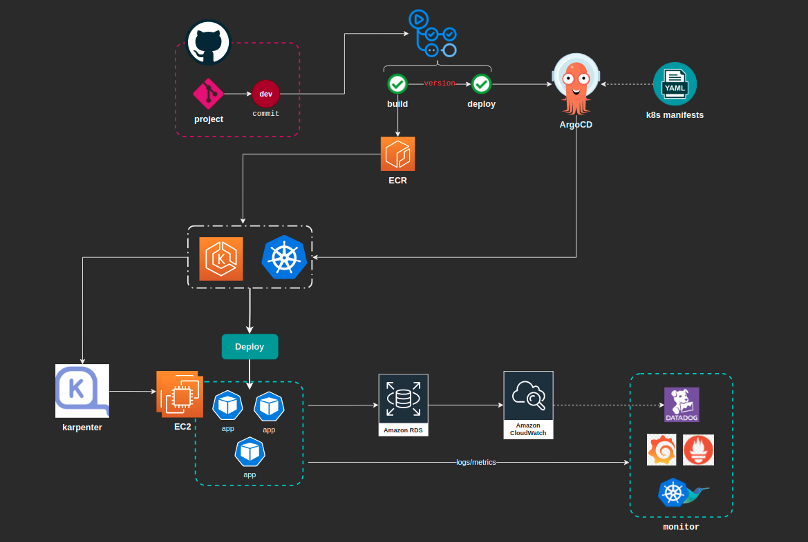

  

<h1 align="center">
  
<b>Upgrade Infra With Autoscaling and Monitoring</b>

</h1>

## Abstract
- Using EKS cluster and AWS Karpenter to provide best security and autoscaling
- ArgoCD for CICD
- Monitoring: AWS cloudwatch, datadog, kibina, fluentbit, prometheus and grafana

---

<h3 align="center">
  <a href="https://dev.to/vumdao">:stars: Blog</a>
   · 
  <a href="https://github.com/vumdao">Github</a>
   · 
  <a href="https://stackoverflow.com/users/11430272/vumdao">stackoverflow</a>
   · 
  <a href="https://www.linkedin.com/in/vu-dao-9280ab43/">Linkedin</a>
   · 
  <a href="https://www.linkedin.com/groups/12488649/">Group</a>
   · 
  <a href="https://www.facebook.com/CloudOpz-104917804863956">Page</a>
   · 
  <a href="https://twitter.com/VuDao81124667">Twitter :stars:</a>
</h3>
